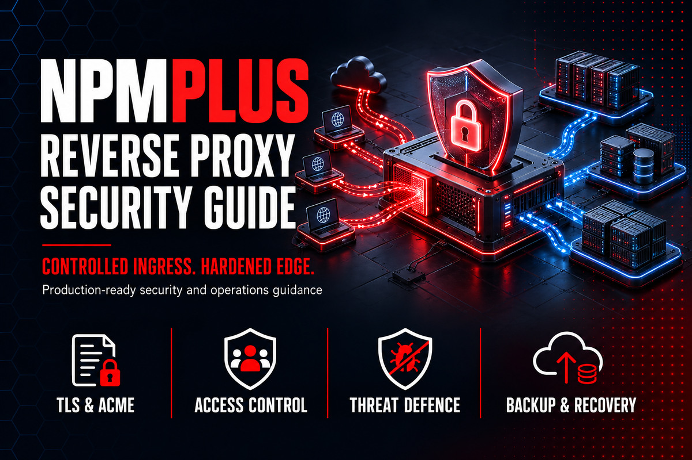

# NPMplus Reverse Proxy Security Guide

  

A production-oriented, security-focused guide for designing, deploying, hardening, validating, monitoring, backing up, and recovering an NPMplus reverse-proxy platform.

This independent guide is published and maintained by [SARABEL Informatika Kft.](https://sarabelinformatika.hu). It complements the upstream NPMplus documentation with an operations-first control model, repeatable deployment records, read-only validation scripts, and recovery evidence.

> NPMplus is an Internet-facing security boundary. A working proxy host is not proof of a secure deployment. DNS, firewall policy, identity, TLS, client-IP trust, upstream isolation, logging, backups, upgrades, and incident response must be designed as one system.

## Design goals

- Expose only the ports and services required for published applications.
- Keep the NPMplus administration interface off the public Internet.
- Preserve the real client IP only through explicitly trusted proxy paths.
- Use automated certificate issuance without exposing DNS credentials unnecessarily.
- Apply least privilege to containers, files, networks, identities, and integrations.
- Make every change reversible and every recovery procedure testable.
- Prefer supported NPMplus features over copied snippets intended for vanilla Nginx Proxy Manager.
- Keep included validation scripts read-only.

## Reference architecture

| Layer | Baseline | Responsibility |
|---|---|---|
| Host | Supported Linux distribution | Patching, time, storage, firewall, Docker runtime |
| Runtime | Docker Engine + Compose v2 | Container lifecycle and declared configuration |
| Edge | NPMplus | HTTP/S ingress, TLS termination, proxy policy, streams |
| Certificates | ACME or managed custom certificates | Issuance, renewal, replacement, expiry monitoring |
| Identity | Local MFA or external OIDC | Administrative authentication and recovery |
| Request authorization | Access lists, mTLS, or auth_request | Per-host and per-location admission controls |
| Threat defence | CrowdSec/AppSec and upstream controls | Detection, blocking, rate limits, abuse response |
| Observability | Docker logs, NPMplus logs, GoAccess, external monitoring | Availability, security, capacity, and audit evidence |
| Recovery | Encrypted, versioned backup of persistent data | Restore of configuration, certificates, and state |

The upstream project changes frequently. Pin tested releases for production, review release notes before upgrades, and validate every example against the current upstream `README.md` and `compose.yaml`.

## Guide map

1. [Scope and threat model](docs/01-scope-and-threat-model.md)
2. [Architecture and trust boundaries](docs/02-architecture-and-trust-boundaries.md)
3. [Host and container baseline](docs/03-host-and-container-baseline.md)
4. [Deployment and Compose controls](docs/04-deployment-and-compose-controls.md)
5. [Administrative identity and access](docs/05-administrative-identity-and-access.md)
6. [DNS, networking, and real client IP](docs/06-dns-networking-and-real-client-ip.md)
7. [TLS, ACME, HTTP/3, and certificates](docs/07-tls-acme-http3-and-certificates.md)
8. [Proxy hosts, locations, and access lists](docs/08-proxy-hosts-locations-and-access-lists.md)
9. [OIDC, auth_request, and mTLS](docs/09-oidc-auth-request-and-mtls.md)
10. [CrowdSec and AppSec](docs/10-crowdsec-and-appsec.md)
11. [Headers, rate limits, and custom Nginx](docs/11-headers-rate-limits-and-custom-nginx.md)
12. [Upstreams, WebSockets, streaming, and TCP/UDP](docs/12-upstreams-websockets-streaming-and-tcp-udp.md)
13. [Logging, monitoring, and alerting](docs/13-logging-monitoring-and-alerting.md)
14. [Backup and recovery](docs/14-backup-and-recovery.md)
15. [Upgrades, migration, and change control](docs/15-upgrades-migration-and-change-control.md)
16. [Troubleshooting, incidents, and acceptance](docs/16-troubleshooting-incidents-and-acceptance.md)

## Quick start

1. Copy [deployment-workbook.md](templates/deployment-workbook.md) and define service owners, domains, data flows, RTO/RPO, authentication, and rollback conditions.
2. Complete the threat model and trust-boundary chapters before exposing ports.
3. Copy [.env.example](examples/.env.example) to a protected local `.env` file. Never commit populated secrets.
4. Review [compose.production.yaml](examples/compose.production.yaml) against the current upstream Compose file. The example is a documented baseline, not a blind installer.
5. Run the read-only host preflight:

~~~bash
sudo ./scripts/npmplus-host-preflight.sh
~~~

6. Deploy in an isolated environment, then run the runtime and TLS checks:

~~~bash
sudo ./scripts/npmplus-runtime-audit.sh
./scripts/npmplus-tls-check.sh proxy.example.com
~~~

7. Record validation evidence and approval in [acceptance-record.md](templates/acceptance-record.md) before production cutover.

## Included operational assets

### Examples

- Hardened Docker Compose baseline
- Environment-variable template without secrets
- CrowdSec acquisition configuration
- NPMplus bouncer configuration template

### Read-only scripts

- Host and Docker readiness report
- Runtime, mounts, ports, capabilities, and health audit
- DNS and TLS endpoint validation
- Backup manifest and integrity evidence generator

The scripts do not install packages, alter NPMplus configuration, request certificates, change firewall rules, restart containers, delete data, or rotate credentials.

### Templates

- Deployment workbook
- Change record
- Recovery-test record
- Incident runbook
- Acceptance record

## Security principles

- Bind the admin UI to localhost or a management-only address whenever possible.
- Do not trust `X-Forwarded-For` from arbitrary sources.
- Forward ports 80/TCP, 443/TCP, and optionally 443/UDP only to NPMplus; never publish backend management ports through the edge by accident.
- Use MFA for local administrators or a carefully designed OIDC deployment with a tested break-glass path.
- Treat DNS-provider tokens, OIDC client secrets, CrowdSec bouncer keys, certificate private keys, and the NPMplus data directory as sensitive.
- Keep a backup from before every upgrade and prove that it can be restored on an isolated host.
- Review generated Nginx configuration and logs after every material host, access-list, certificate, or integration change.

## Important upstream differences

NPMplus is a security-focused fork of Nginx Proxy Manager and deliberately changes defaults and behavior. It uses HTTPS for the admin interface, supports HTTP/3/QUIC, CrowdSec/AppSec, OIDC, mTLS, multiple access lists, `auth_request` integrations, hardened TLS, and additional proxy modes. Internet tutorials written for vanilla Nginx Proxy Manager may be redundant, incompatible, or unsafe for NPMplus.

## Project status

Version 1.0.0 is the initial production-oriented baseline. See [ROADMAP.md](ROADMAP.md), [CHANGELOG.md](CHANGELOG.md), and [SUPPORTED_VERSIONS.md](SUPPORTED_VERSIONS.md).

## About SARABEL Informatika

[SARABEL Informatika Kft.](https://sarabelinformatika.hu) provides IT infrastructure design, server and Docker operations, secure remote access, monitoring, backup, Microsoft 365, and managed support services.

For a production assessment, reverse-proxy hardening review, migration, or managed operation, visit [sarabelinformatika.hu](https://sarabelinformatika.hu).

## License and independence

Documentation, scripts, and original examples in this repository are released under the [MIT License](LICENSE). NPMplus itself is maintained by its upstream project under its own license. This repository is independent, is not an official NPMplus project, and does not redistribute NPMplus.

